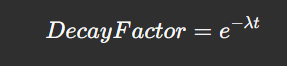

# 🐶 Woof: Stray Dog Reporting & Adoption System

## 📝 1. User Reporting System

### 📌 Report Stray Dogs with Ease
Users can report stray dogs by providing the following details:
- **Location:** Auto-detect via GPS or manual pin selection.
- **Photo Upload:** Verify the dog's condition with an image.
- **Additional Notes (Optional):** Specify the dog's condition if it isn't clear from the image.
- **Vision AI Model for Condition Analysis:** AI-based analysis of the dog's health, classifying the condition into:
  - 🟢 **Healthy**
  - 🟡 **Mildly Injured/Sick**
  - 🟠 **Moderately Injured/Sick**
  - 🔴 **Critical Condition**

---

## 🌍 2. AI-Based Hotspot Detection

### 🔍 AI-Based Hotspot Detection Using DBSCAN

### 📌 Approach Overview
Our enhanced **DBSCAN (Density-Based Spatial Clustering of Applications with Noise)** algorithm prioritizes severity while also considering older reports. This ensures detected hotspots accurately reflect real-world conditions.

### 🚀 Key Features

#### 1. **Density-Based Clustering (DBSCAN)**
DBSCAN operates with two core parameters:
- **Epsilon (ε):** Defines the neighborhood radius around a point.
- **MinPts:** The minimum number of points required within `ε` to form a dense region.

DBSCAN categorizes reports into:
- **Core Points:** Points with at least `MinPts` neighbors within `ε`.
- **Border Points:** Points within `ε` of a core point but lacking enough neighbors themselves.
- **Noise Points (Outliers):** Points that do not belong to any cluster.

#### 2. **Severity Weighting**
Reports are weighted based on severity, giving higher priority to more critical cases in clustering.

#### 3. **Time Decay Factor**
Older reports gradually lose their influence using an **exponential decay function**:




#### 4. **Custom Weighted Distance Function**
A **modified distance function** incorporates severity-based weighting, ensuring that high-severity points are more closely clustered.


### 📊 Visualization with Folium
Clusters are plotted on an interactive **Folium** map:
- **🔴 Red = Emergency** (High Priority)
- **🟠 Orange = Injured** (Medium Priority)
- **🟢 Green = Healthy** (Low Priority)

Each report displays **cluster ID** and **priority score**, helping users and authorities identify critical areas efficiently.

---

## 🏡 3. AI-Powered Adoption System

### 🌟 Key Features

#### 1. **Choose Your Perfect Companion**
- Browse a diverse range of dogs available for adoption.
- Filter by breed, age, size, temperament, and special needs.
- View detailed profiles including images, medical history, and personality traits.

#### 2. **Schedule a Meeting**
- Book an appointment to meet your chosen dog.
- Virtual or in-person meetings available based on preference.

#### 3. **Fill Out an Adoption Form**
- Complete a structured form to ensure the perfect match.
- Provide details about your living situation, experience with pets, and preferences.

#### 4. **AI Assistant for Assistance**
- Get instant answers to your queries regarding the adoption process.
- Receive guidance on pet care, training, and settling your new pet at home.

#### 5. **Policy & Support Assistance**
- Learn about adoption fees, return policies, and responsibilities.
- 24/7 support for adopters throughout the process.

---

## 🛠️ 4. Blockchain-Based Animal Donation Platform

We created a **blockchain-based animal donation platform using Indian Rupees (₹)** to address the lack of transparency, fraud, and inefficiency in traditional donation systems. By leveraging blockchain technology, we ensured that every rupee donated is tracked in real-time, with funds released only when verified proof of usage (like vet bills or food receipts) is provided by NGOs. 

### 💼 Key Use Cases

#### 1. **Transparent Donation Tracking**
- Every donation is recorded on the blockchain.
- Donors can see exactly how their money is used.

**Example:**
```
TX ID: NPCI-2023-7H8K9L
Amount: ₹500
Purpose: Medical Care for Stray Dog
Status: Confirmed
Block: 123456
Hash: 0x89a3b...c7d2
```

#### 2. **Fraud Prevention**
- Funds are released only when NGOs provide proof (vet bills, food receipts).

**Example Smart Contract:**
```solidity
function releaseFunds(address NGO, uint256 amount) public {
    require(proofSubmitted[NGO] == true, "Proof not submitted");
    require(fundsLocked[NGO] >= amount, "Insufficient funds");
    // Release funds to NGO
}
```

#### 3. **Donor Authentication**
- Blockchain-based identity linked to Aadhaar or UPI.

**Example:**
```
Donor ID: inr:0xIND9876...5432
Verified: Yes (Aadhaar-linked)
Total Donations: ₹10,000
```

#### 4. **Real-Time Fund Allocation**
- Automated fund distribution based on urgency.

**Example Smart Contract:**
```solidity
function allocateFunds(uint256 amount, string memory purpose) public {
    if (keccak256(bytes(purpose)) == keccak256(bytes("Medical Emergency"))) {
        // Priority allocation
    }
}
```

#### 5. **Tax Benefits and Receipts**
- Auto-generate blockchain-based tax receipts.

**Example:**
```
Receipt ID: NPCI-RCPT-2023-123
Amount: ₹1,000
Date: 2023-10-15
Tax Exemption: 80G Approved
```

#### 6. **NGO Accountability**
- Track fund usage and verify proofs on the blockchain.

**Example:**
```
NGO ID: NGO-0xIND1234
Funds Received: ₹50,000
Funds Used: ₹45,000
Proofs Submitted: 5
```

#### 7. **Emergency Fundraising**
- Smart contracts trigger emergency fundraising campaigns.

**Example:**
```
Emergency Alert: Injured Dog
Target: ₹10,000
Raised: ₹7,500
Donors: 25
```

---

🎉 **Start your journey to finding a loving furry friend and making a difference today!**
